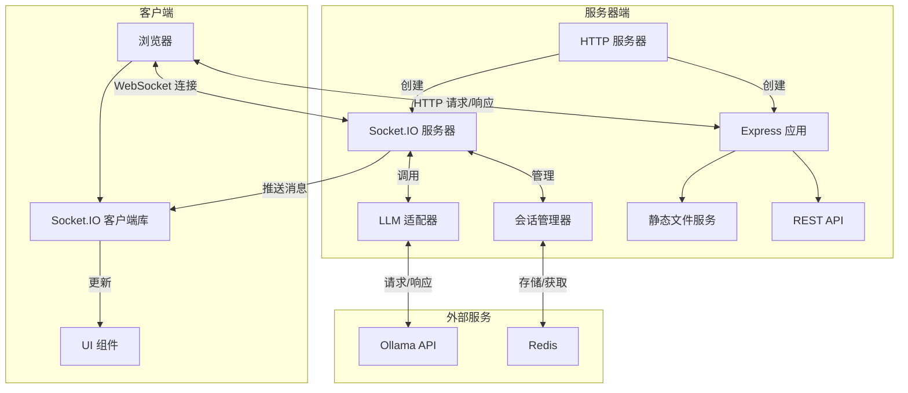

# MCP协议服务 - 集成RAG功能

这是一个基于Node.js和Socket.IO的MCP（大模型上下文协议）服务实现，现在集成了RAG（检索增强生成）功能，可以为大模型提供知识库支持。

## 功能特性

### 核心功能
- **MCP协议支持**: 完整的MCP协议实现，支持会话管理和上下文维护
- **实时通信**: 基于Socket.IO的实时双向通信
- **流式响应**: 支持大模型的流式文本生成
- **会话持久化**: 使用Redis存储会话状态和历史记录

### RAG功能
- **多格式文档支持**: 支持.txt, .md, .js, .ts, .py, .java, .cpp, .c, .h, .json, .xml, .html, .css等格式
- **智能文档处理**: 自动分割文档为合适的文本块
- **向量化存储**: 使用ChromaDB进行高效的向量存储
- **语义搜索**: 基于Ollama嵌入模型的语义检索
- **增强回答**: 结合检索到的文档信息生成更准确的回答
- **知识库管理**: 支持添加、查看统计和清空知识库

## 技术栈

- **后端**: Node.js, Express, Socket.IO
- **数据库**: Redis (支持Docker部署)
- **向量数据库**: ChromaDB (支持Docker部署)
- **嵌入模型**: Ollama (dengcao/Qwen3-Embedding-4B:Q4_K_M)
- **大语言模型**: Ollama (deepseek-r1:7b)
- **前端**: HTML5, CSS3, JavaScript
- **容器化**: Docker, Docker Compose

## 安装和运行

### 前置要求
1. Node.js 18+ 
2. Docker 和 Docker Compose (推荐)
3. Ollama (已安装deepseek-r1:7b和dengcao/Qwen3-Embedding-4B:Q4_K_M模型)

### 快速启动

#### 方式一：Docker环境（推荐）

```bash
# 启动Docker服务 (Redis + ChromaDB)
./docker-manager.sh start

# 启动完整服务
./start-docker.sh
```

#### 方式二：混合环境

```bash
# 启动Docker服务
./docker-manager.sh start

# 启动应用服务
./start.sh
```

#### 方式三：完全本地环境

```bash
# 启动所有服务
./start.sh
```

### Docker环境管理

```bash
# 查看Docker服务状态
./docker-manager.sh status

# 查看服务日志
./docker-manager.sh logs

# 停止Docker服务
./docker-manager.sh stop

# 重启Docker服务
./docker-manager.sh restart

# 清理所有数据
./docker-manager.sh clean
```

服务将在 http://localhost:3000 启动

## 使用指南

### 1. 基本聊天功能
1. 打开浏览器访问 http://localhost:3000
2. 点击"新建会话"创建会话
3. 在输入框中输入问题并发送
4. 系统会基于大模型知识回答您的问题

### 2. RAG功能使用

#### 添加文档到知识库
1. 在"RAG知识库管理"面板中，输入文档路径
2. 支持单个文件或整个目录
3. 点击"添加文档"按钮
4. 系统会自动处理文档并添加到向量数据库

#### 启用RAG功能
1. 确保RAG状态显示为"已启用"
2. 在上下文设置中添加 `"useRAG": true`
3. 发送问题，系统会自动检索相关文档并基于文档信息回答

#### 管理知识库
- **查看统计**: 点击"刷新统计"查看知识库中的文档数量
- **清空知识库**: 点击"清空知识库"删除所有文档（不可恢复）

### 3. 上下文设置
在上下文输入框中可以设置各种参数：
```json
{
  "language": "zh-CN",
  "tone": "professional",
  "useRAG": true,
  "temperature": 0.7,
  "top_p": 0.9,
  "context_length": 4096
}
```

## API接口

### REST API

#### 添加文档
```http
POST /api/rag/add-documents
Content-Type: application/json

{
  "documentsPath": "/path/to/documents"
}
```

#### 获取统计信息
```http
GET /api/rag/stats
```

#### 清空知识库
```http
DELETE /api/rag/clear
```

#### 切换RAG状态
```http
POST /api/rag/toggle
Content-Type: application/json

{
  "enabled": true
}
```

#### 获取RAG状态
```http
GET /api/rag/status
```

### WebSocket事件

#### 添加文档
```javascript
socket.emit('rag_add_documents', { documentsPath: '/path/to/documents' }, callback);
```

#### 获取统计
```javascript
socket.emit('rag_get_stats', callback);
```

#### 清空知识库
```javascript
socket.emit('rag_clear', callback);
```

#### 切换RAG状态
```javascript
socket.emit('rag_toggle', { enabled: true }, callback);
```

#### 获取RAG状态
```javascript
socket.emit('rag_status', callback);
```

## 项目结构

```
test-deepseek-r1-7b/
├── mcp/                    # MCP协议相关
│   ├── llm_adapter.js     # LLM适配器（集成RAG）
│   ├── protocol.js        # MCP协议实现
│   └── session.js         # 会话管理
├── rag/                   # RAG功能模块
│   ├── document_processor.js  # 文档处理器
│   ├── vector_store.js       # 向量存储管理
│   └── rag_manager.js        # RAG管理器
├── documents/             # 示例文档目录
│   ├── README.md         # 项目概述文档
│   ├── api_guide.md      # API使用指南
│   └── configuration.md  # 配置说明文档
├── public/               # 静态文件
│   └── style.css         # 样式文件
├── docker-compose.yml    # Docker Compose配置
├── docker-manager.sh     # Docker环境管理脚本
├── start.sh              # 通用启动脚本
├── start-docker.sh       # Docker环境启动脚本
├── test_rag.js           # RAG功能测试脚本
├── server.js             # 主服务器文件
├── redis.js              # Redis连接配置
├── index.html            # 前端界面
├── package.json          # 项目配置
└── README.md             # 项目说明
```

## 配置说明

### 环境变量
- `PORT`: 服务端口 (默认: 3000)
- `OLLAMA_API_BASE`: Ollama API地址 (默认: http://localhost:11434)
- `OLLAMA_MODEL`: 使用的模型名称 (默认: deepseek-r1:7b)

### Redis配置
在 `redis.js` 中配置Redis连接参数：
```javascript
const redisConfig = {
    host: 'localhost',
    port: 6379,
    // 其他配置...
};
```

### Docker配置
Docker服务配置在 `docker-compose.yml` 中：
- **Redis**: 端口6379，数据持久化
- **ChromaDB**: 端口8000，向量数据存储
- **健康检查**: 自动监控服务状态
- **数据卷**: 持久化存储数据

## 故障排除

### 常见问题

1. **Ollama连接失败**
   - 确保Ollama服务正在运行
   - 检查模型是否已下载: `ollama list`
   - 验证API地址是否正确

2. **Redis连接失败**
   - 检查Docker Redis容器状态: `./docker-manager.sh status`
   - 查看Redis日志: `./docker-manager.sh redis logs`
   - 重启Redis服务: `./docker-manager.sh redis restart`

3. **ChromaDB初始化失败**
   - 检查Docker ChromaDB容器状态
   - 查看ChromaDB日志: `./docker-manager.sh chroma logs`
   - 重启ChromaDB服务: `./docker-manager.sh chroma restart`

4. **文档处理失败**
   - 检查文件路径是否正确
   - 确保文件格式受支持
   - 检查文件权限

### Docker环境问题

1. **容器启动失败**
   ```bash
   # 查看容器状态
   docker-compose ps
   
   # 查看详细日志
   docker-compose logs
   
   # 重启所有服务
   ./docker-manager.sh restart
   ```

2. **数据持久化问题**
   ```bash
   # 查看数据卷
   docker volume ls
   
   # 备份数据
   ./docker-manager.sh backup
   
   # 恢复数据
   ./docker-manager.sh restore
   ```

3. **网络连接问题**
   ```bash
   # 检查网络
   docker network ls
   
   # 重建网络
   docker-compose down
   docker-compose up -d
   ```

### 日志查看
服务运行时会输出详细的日志信息，包括：
- 连接状态
- 文档处理进度
- RAG查询结果
- 错误信息

## 开发说明

### 添加新的文档格式支持
在 `rag/document_processor.js` 中的 `supportedExtensions` 数组中添加新的文件扩展名。

### 自定义向量化参数
在 `rag/vector_store.js` 中修改 `splitIntoChunks` 方法的参数：
- `chunkSize`: 文本块大小
- `overlap`: 重叠大小

### 扩展RAG功能
可以通过修改 `rag/rag_manager.js` 来添加新的RAG功能，如：
- 文档过滤
- 多语言支持
- 自定义检索策略

### Docker环境开发
```bash
# 开发环境启动
docker-compose -f docker-compose.dev.yml up -d

# 查看实时日志
docker-compose logs -f

# 进入容器调试
docker exec -it mcp-redis bash
docker exec -it mcp-chroma bash
```

## 部署说明

### 生产环境部署
```bash
# 生产环境配置
export NODE_ENV=production
export PORT=3000

# 启动Docker服务
docker-compose -f docker-compose.prod.yml up -d

# 启动应用
node server.js
```

### 监控和备份
```bash
# 监控服务状态
./docker-manager.sh status

# 备份数据
./docker-manager.sh backup

# 查看资源使用
docker stats
```

## 许可证

ISC License

## 贡献

欢迎提交Issue和Pull Request来改进这个项目。


