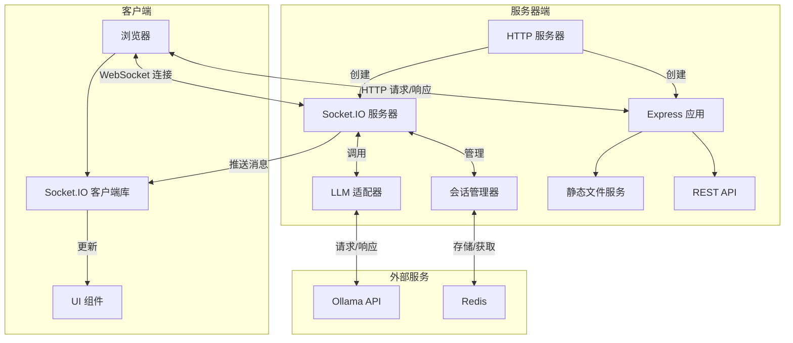

# AI Talk Page Using MCP Protocol
使用 ollama 在本地运行一个 deepseek-r1:7b的模型，使用node编写MCP服务，供页面调用大模型。

```mermaid
flowchart TD
    subgraph 客户端
        A[浏览器] --> B[Socket.IO 客户端库]
        B -->|更新| C[UI 组件]
    end
    
    subgraph 服务器端
        D[HTTP 服务器] -->|创建| E[Socket.IO 服务器]
        E <-->|管理| F[会话管理器]
        E <-->|调用| G[LLM 适配器]
        D -->|创建| H[Express 应用]
        H --> I[静态文件服务]
        H --> J[REST API]
    end
    
    subgraph 外部服务
        K[Ollama API]
        L[Redis]
    end
    
    A <-->|HTTP 请求/响应| H
    A <-->|WebSocket 连接| E
    F <-->|存储/获取| L
    G <-->|请求/响应| K
    E -->|推送消息| B
```
